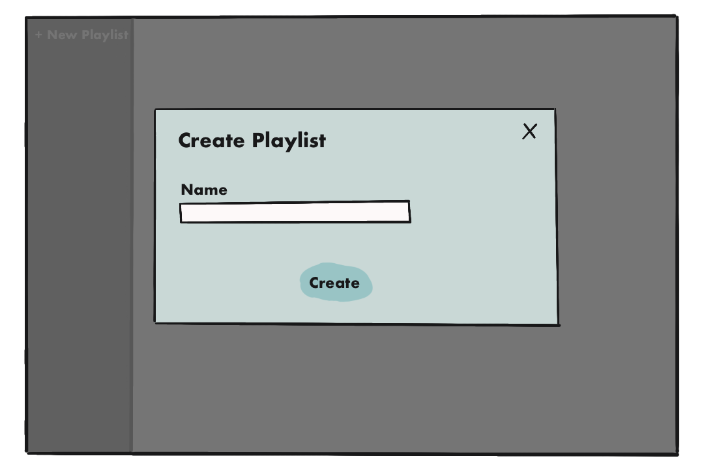
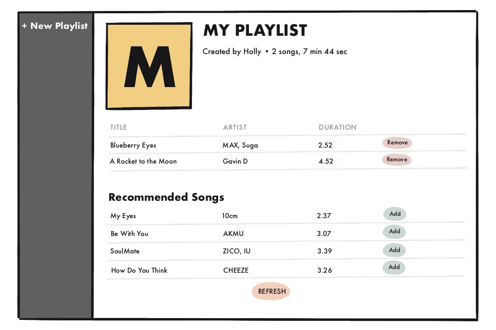

# AppMan My Playlist 2020

I am a customer who want you to build an application about creating playlist (like spotify) with the following requirements: 

| User Story | Acceptance Criteria |
|:---|:---|
|As a registered user, I am required to login so that I can access the application.||
|As a registered user, I want to see the create button so that I can create the playlist.||
|As a registered user, I want to see the song list so that I can add the song to my playlist.||
|As a registered user, I want to see random recommended song so that I can select the difference song.||
|As a registered user, I want to manage the playlist so that I can add or remove the song anytime.||
|As a registered user, I want to know how long of my playlist so that I can see the total duration of the playlist.||

## Also, we already prepared some stuff for you!!! :D

### 1. Interface

### 2. Songs
[JSON of songs list](songs.json)

## How we score you??!!!
  - If you can complete all the requirements above, We surely score you 100!!!! NO reason!!
    - We will give you all the feedback later ;)
  - IF YOU FEEL LIKE SOMETHING IS MISSING, WE HAVE EXTRA SCORE FOR ANY ADDITIONAL THING YOU CAN PROVIDE. (Extra can be unit test, refactoring, performance tuning, etc. REMEMBER MAXIMUM IS NOT 100!!!)

If you have any questions, please do not hesitate to ask us anytime.
Wish you luck!! :)
